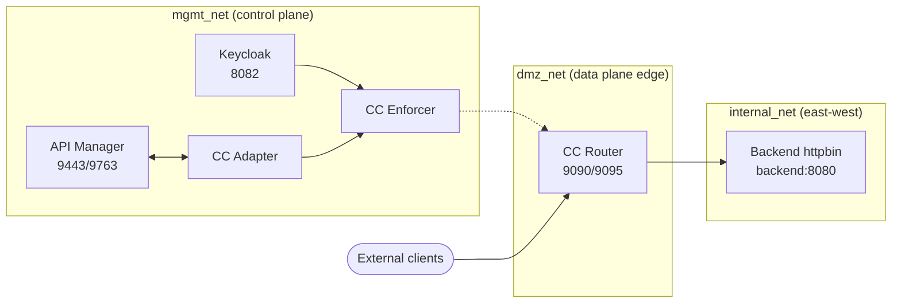

# WSO2 API Management in Docker

Docker-first scaffold with WSO2 API Manager (control plane), Choreo Connect gateway (data plane), optional Keycloak (external IAM), and a sample backend.

## Components and endpoints
- Control plane: API Manager at https://localhost:9443 (self-signed), http://localhost:9763 (local only)
- Data plane: Choreo Connect gateway router http://localhost:9090, admin/metrics http://localhost:9095
- Backend (httpbin): http://localhost:8081
- External IAM (optional): Keycloak http://localhost:8082, realm `wso2` auto-imported

### Control/Data plane deployment view (Mermaid)


Networks in `docker-compose.yml`:
- `mgmt_net`: control plane traffic between API Manager, Keycloak, and gateway adapter/enforcer
- `dmz_net`: data plane edge; router is exposed here (adapter/enforcer also attached)
- `internal_net`: east-west traffic to backend services

## Prerequisites
- Docker and Docker Compose v2
- At least 6 GB RAM allocated to Docker

## Start the stack
```sh
docker compose up -d
```

## Publish an API (/httpbin to backend)
1) Open Publisher: https://localhost:9443/publisher (accept self-signed cert); login with `ADMIN_USERNAME` / `ADMIN_PASSWORD` from [.env](.env).
2) Create API: REST → target URL `http://backend:8080`.
3) Ensure resource `/httpbin` (or import a Swagger with that base path).
4) Save, Publish, and deploy to environment `Default`.

## Get a token from Keycloak (client credentials)
```powershell
$resp = Invoke-RestMethod -Method Post `
   -Uri 'http://localhost:8082/realms/wso2/protocol/openid-connect/token' `
   -Body @{ grant_type='client_credentials'; client_id='choreo-gateway'; client_secret='choreo-gateway-secret'; audience='choreo-gateway' }
$token = $resp.access_token
```

## Call the gateway with the token
```powershell
Invoke-WebRequest -Uri 'http://localhost:9090/httpbin/status/200' -Headers @{ Authorization = "Bearer $token" }
```
If you see 404, confirm the API is published and deployed to `Default`.

## Configure APIM to trust Keycloak (Key Manager)
- Admin Portal: https://localhost:9443/admin → Key Managers → Add (Generic OIDC/Custom)
- Issuer: `http://keycloak:8082/realms/wso2`
- JWKS: `http://keycloak:8082/realms/wso2/protocol/openid-connect/certs`
- Token/Introspection (optional if JWT-only): `http://keycloak:8082/realms/wso2/protocol/openid-connect/token` and `/introspect`
- Client ID/secret for admin ops: `apim-admin` / `apim-admin-secret`
- Enable and save

## Keycloak defaults
- Realm: `wso2` (auto-import)
- Admin user: `KEYCLOAK_ADMIN` / `KEYCLOAK_ADMIN_PASSWORD` from [.env](.env)
- Clients: `apim-admin` (secret `apim-admin-secret`), `choreo-gateway` (secret `choreo-gateway-secret`)

## Certificates and mTLS
- Gateway expects `mg.pem`/`mg.key` at `/home/wso2/security/keystore` (dev self-signed in [config/choreo-connect/security/keystore](config/choreo-connect/security/keystore))
- Envoy trusts `/home/wso2/security/truststore/mg.pem` (dev copy in [config/choreo-connect/security/truststore](config/choreo-connect/security/truststore))
- Replace with real certs/keys for any non-demo use

## Inline verification (no script files)
```powershell
powershell -NoLogo -NoProfile -Command "& {
   $ErrorActionPreference='Stop';
   $cb=[System.Net.ServicePointManager]::ServerCertificateValidationCallback;
   [System.Net.ServicePointManager]::ServerCertificateValidationCallback={ $true };
   function Assert([bool]$c,[string]$m){ if(-not $c){ throw $m } }
   $svc = docker compose ps --format json | ConvertFrom-Json;
   foreach($n in 'apim','dmz-gateway-adapter','dmz-gateway-enforcer','dmz-gateway-router','backend','keycloak'){
      $s=$svc | Where-Object Name -eq $n; Assert ($null -ne $s) "Service $n missing"; Assert ($s.State -eq 'running') "Service $n not running ($($s.State))";
   }
   foreach($p in 9443,9090,9095,8081,8082){ Assert (Test-NetConnection localhost -Port $p -WarningAction SilentlyContinue).TcpTestSucceeded "Port $p unreachable" }
   Assert ((Invoke-WebRequest -Uri 'http://localhost:8081/status/200' -UseBasicParsing).StatusCode -eq 200) 'Backend probe failed'
   Write-Host 'verification passed'
   [System.Net.ServicePointManager]::ServerCertificateValidationCallback=$cb
}"
```

## Adding another DMZ gateway segment
- Duplicate the `dmz-gateway-*` services in [docker-compose.yml](docker-compose.yml), rename (e.g., `dmz2-gateway-router`), and attach to a new `dmz_net` variant (e.g., `dmz_net_eu`)
- Expose a new listener port and point DNS/LB to it
- Adjust [config/choreo-connect/config.toml](config/choreo-connect/config.toml) and certs per segment

## Notes and caveats
- Self-signed certs by default; replace before real use
- Persistence: API artifacts live in the `apim_repository` volume; clear only for a fresh start
- Resources: allocate sufficient RAM/CPU; tune `JAVA_OPTS` if APIM is memory constrained
- Harden for production: external DBs, analytics, proper certs, and non-default credentials
